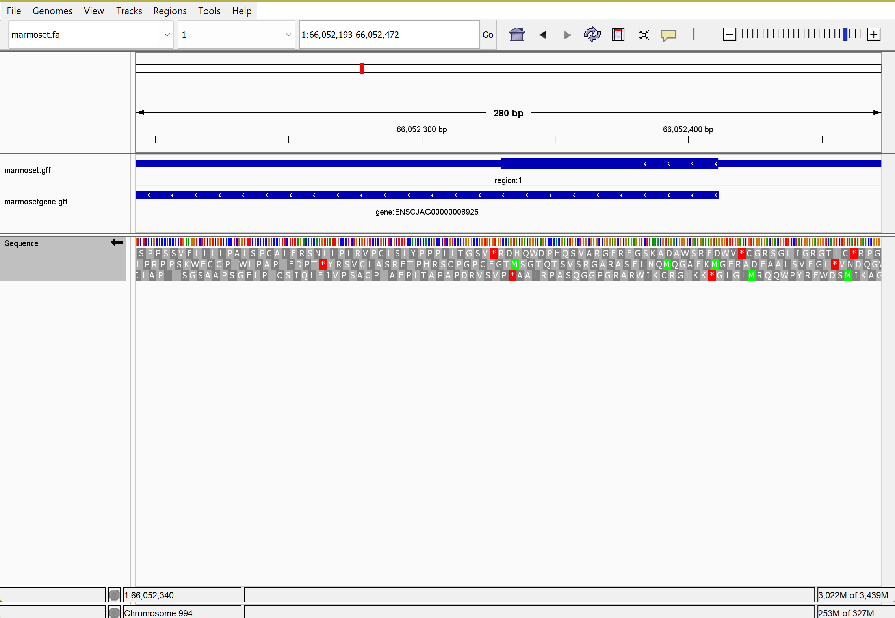

```bash
cd ~/wk03/igv
```
we get the fasta file as the sequence file of our organism to have the genome (what the identity is/ what the sequence is)
```bash
wget https://ftp.ensemblgenomes.ebi.ac.uk/pub/bacteria/current/fasta/bacteria_0_collection/acinetobacter_baumannii_aye_gca_000069245/dna/Acinetobacter_baumannii_aye_gca_000069245.ASM6924v1.dna.toplevel.fa.gz
```
unzip it
```bash
gunzip Acinetobacter_baumannii_aye_gca_000069245.ASM6924v1.dna.toplevel.fa.gz
```
change the name of the file to a more easy to read
```bash
mv Acinetobacter_baumannii_aye_gca_000069245.ASM6924v1.dna.toplevel.fa abaum.fa
```
using tools such as seqkit to look over the details stored in the file
```bash
seqkit stats abaum.fa
```
look at it with a different tool
```bash
cat abaum.fa | grep ">"
```
since the fasta starts with a > sign, so we want to look for that lines and from the outputit will tell us how many plasmids and chromosomes are in the sequenced reference genome (or how many sequences are in the file)

now we want to get the annotation file (gff) to have the features of the genome (where the identity is/where the genes are)
```bash
wget https://ftp.ensemblgenomes.ebi.ac.uk/pub/bacteria/current/gff3/bacteria_0_collection/acinetobacter_baumannii_aye_gca_000069245/Acinetobacter_baumannii_aye_gca_000069245.ASM6924v1.62.gff3.gz

gunzip Acinetobacter_baumannii_aye_gca_000069245.ASM6924v1.62.gff3.gz

mv Acinetobacter_baumannii_aye_gca_000069245.ASM6924v1.62.gff3 abaum.gff
```



On the position 617150 there is a gene coded on the reverse strand that does not have a starting codon on the reading frames. it has a stop codon on the orf3, but the start codon does not placed on the start of the gene, after the biological region ended, the M will be the 14th aa
why when we open a file the igv creat an index .fai. file?