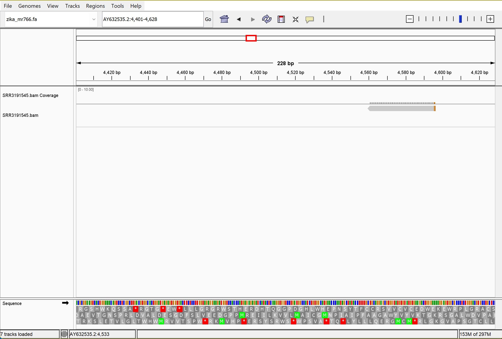

*Hello* **Dr. Albert**

# Assignment for Week 6

### 1. Transform the script into a Makefile that includes rules for:
#### Obtaining the genome
#### Downloading sequencing reads from SRA

### 2. Your README.md should explain the use of the Makefile in your project.
The Makefile has three sections. The first is to define different parameters in the code such as the genome name, bioproject number, SRR number, URL to download the reads and other defining variables. It is worth to note that the first section can be adjusted, but there shouldn't be any change to the second and third sections The second section is setting up some useful defaults. And the third section contains multiple subsections such as rules to download the reference genome from NCBI and the sequencing reads from SRA using the defined parameters. the targetss in the third section are as follows:
usage: display the usage of the Makefile
ref: download the reference genome and the annotation files from NCBI using efetch
index: indexing the genome using bwa index
read: download the sequencing reads from SRA using bio command and aria2c for faster downloading
align: aligning the reads to the reference genome using minimap2 and generate a sorted. and indexing the BAM file to generate the .bai file
stat: show some stats about the genome using seqkit
all: create the necessary files and directories by calling the other targets in order: ref, read, align, stats, and clean.

the make file can be run as dollows:
```bash
make all
```
This command will execute all the targets in the Makefile in the specified order.

Some notes and quick questions:

a) The 'N' variable already can be set up to 10k or even without the -X glag to download the whole dataset and to make the code more universal, but since the assignment is based on the previous week assignmet, it sets to 1440 for 10x coverage of the Zika virus.

b) One note to be consider is that, for simplicity I put one read in the makefile. But if the read contains multiple SRRs, the following code can be used. However, I tested the makefile once with the foloowing codes for multiple SRRs but it does not work. SRR=SRP070895 which contains multiple SRRs. So I switched to one SRR (SRR3191545, a paired end) for simplicity. if I use a paired end read I should divide the N by 2, but since I'm using one read (R1) that's why I kept the N same as for a single read.
```bash
download the reads:
	# Get the reads from the source and make a text file with SRR ids
	bio search ${SRR} | jq -r '.[].run_accession' > sra_ids.txt
	cat sra_ids.txt
	# make the output dir
	mkdir -p reads
	# loop over each SRR in sra_ids.txt and run your exact command
	while read -r SRR; do
		fastq-dump -X ${N}  -F --outdir ${R1} --split-files "${SRR}"
	done < sra_ids.txt
```
I was wondering what would be wrong with this approach for multiple SRRs. I think the issue here will be that the SRR number for the project that contain multiple reads in this, can not be processsed further, because thsi is not a real SRR number compare to the real read of i.e. SRR3191545. Could this be right?

c) I also wanted to download the reads from the following code:
```bash
	# -x 5: use 5 connections
	# -c: continue download
	# --summary-interval=10: print summary every 10 seconds
	aria2c -x 5 -c --summary-interval=10 ${URL}
```
first i tried it in the makefile but it failed. the reason could be that the downlaoded file is a gzip format, so I have to define another step to gunzip it and then use it. am i right?

d)for indexing and aligning, we can also use bwa tool, but the minimap2 is more preferrable because it does not require indexing step :
```bash
	# Align the reads"
	bwa mem -t 4 ${REF} ${R1} ${R2} | samtools sort  > ${BAM}
	samtools index ${BAM}
```
whioh makes the aligning faster I think.

e) Also, we can add the following step to clean all the data that was generated during the process:
```bash
# Clean up generated files
clean:
	rm -rf ${REF} ${R1} ${R2} ${BAM} ${BAM}.bai
```
but i didn't add this target because I want the files to be there for visualization.

f) A question: about downloading genome assembly from NCBI in the download the genome target
I don't know if that would work or no, so that's why I bringing this up here to check the validity with you. I am thinking of using the genome assembly (GCF) to downlaod the reference genome and the annotation. And then use wildcard '*' to chaange the name of the files. Something like this under the target in Makefile:
```bash
GCF=GCF_000882815
datasets download genome accession ${GCF} --include gff3,gtf,genome
unzip -n ncbi_dataset.zip
mv *.fa ${NAME}.fa
mv *.gff ${NAME}.gff
mv *.gtf ${NAME}.gtf
```
I don't knwo if this approach would work or not. but anyway, will continue the assignment and if you were positive about it, I will add it to the Makefile from the next session.

### 3. Add the following targets to the Makefile:
#### index: Index the genome
#### align: Generate a sorted and indexed BAM file by aligning reads to the genome
It has been done in the makefile in 'index' and 'align' target.

### 4. Visualize the resulting BAM files for both simulated reads and reads downloaded from SRA.



### 5. Generate alignment statistics for the BAM file.
#### What percentage of reads aligned to the genome?
mapped/total reads ==> 3/1440 = 0.208%
#### What was the expected average coverage?
10x coverage
#### What is the observed average coverage?
so based on
```bash
samtools coverage
```
meandepth is 0.013
#### How much does the coverage vary across the genome? (Provide a visual estimate.)
it is not good because it is very sparse. the coverage is about 1.35%, and as the stats shows only the 3 reads are mapped with covering 146 bases and about 98.65% of the genome has zero coverage.
