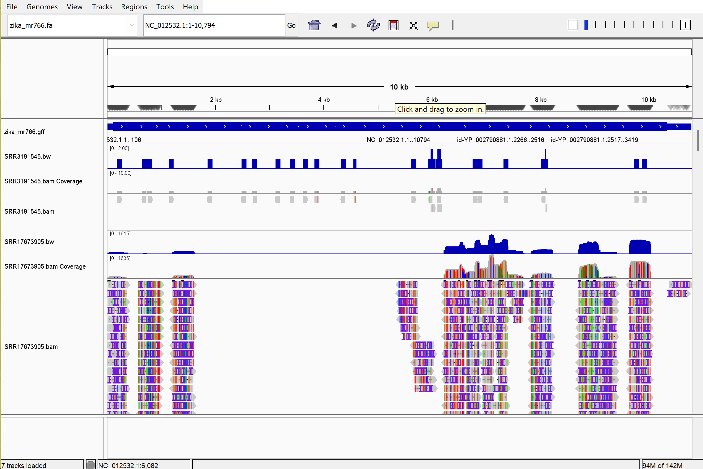

*Hello* **Dr. Albert**

# Assignment for Week 7

### Add additional code to your Makefile to also create bigWig coverage tracks. See the WIGGLE: Genome coverage page for code.
One note:
the N adjusted to 10000, because number of reads and coverage from the N=1440 is less and maybe will be good to understand the comparison between these two reads. Additionaly it will be enable the code to be fast and at the same time have enough number of reads and coverage to check for it. We can also download the whole reads but it will take more than 5-10mins for the whole analysis, so we will stick to N=10000.

Further changes for the week 7 assignment will be included based on the code in the Makefile and answering to the following questions.

### In your README.md, demonstrate the use of your Makefile to generate a BAM file for both the original data and the second sequencing data obtained with a different instrument.
a 'wiggle' target added to the makefile. also two parameter 'BW' and 'BG' added to the first of the make file. also because of adding the 'wiggle' target, the usage and the 'all' directories at the end of the Makefile have been updated.
The other sequence using the Nanopore (MinION) sequencing machine with the project number of PRJNA798536. To produce the results for the second sequence we will use the following bash command.
```bash
# Get the fastq files from SRA
make all SRR=SRR17673905
```

### Visualize the GFF annotations and both wiggle and BAM files in IGV.



### Answer the following questions:
#### Briefly describe the differences between the alignment in both files.
#### Briefly compare the statistics for the two BAM files.
based on the -flagstat and -coverage in samtools:
SRR3191545 (short-read, Illumina): Almost nothing maps. only 25 aligned the Zika genome. Coverage of the genome is 15.8% of bases, 0.17× mean depth. Base qualities are high (mean Q 36.6), mapping qualities high (53.1), but there just aren’t many viral reads in this library.

SRR17673905 (long-read, Nanopore): Most of the subset maps: 6,601/10,043 reads aligned. Coverage is 49.8% of the genome with a 200× mean depth. it has lower mean base Q (21.8), some split alignments (43 supplementary), lower mean MAPQ (44.8) than Illumina.

#### How many primary alignments does each of your BAM files contain?
with setting up N=10000, the number of reads is 25, which means the (primary) mapped for the original SRR is 25 (0.25%). But for the second read with the Nanopore (although we remember from the week 5 that the quality of the reads was not good compare to the original read) the number of primary read of 6558 (65.58%).
#### What coordinate has the largest observed coverage? (hint: samtools depth)
```bash
cd bam
samtools depth SRR3191545.bam | sort -k3 -nr | head
samtools depth SRR17673905.bam | sort -k3 -nr | head
```
for SRR3191545, AY632535.2:8106 with depth 2
for SRR17673905, AY632535.2:7127 and AY632535.2:7123 with depth 1626
#### Select a gene of interest. How many alignments on the forward strand cover the gene?
I was interested to look for the capsid protein but based on the research, I just realized that there is just one gene known as POLY in Zika vitus and the RNA from that is translated as a single polypeptide chain including all the viral proteins: C-prM-E-NS1-NS2A-NS2B-NS3-NS4A-NS4B-NS5.

However, we use the following code to check for the genes in the annotated file.
```bash
cd ref
cat zika_mr766.gff | cut -f 3 | sort | uniq -c | sort -r -n 
```
since I did not remove everything that starts with a comment, the output shows all the information, but what is interested for us is that part:
      14 mature_protein_region_of_CDS
      1 three_prime_UTR
      1 region
      1 gene
      1 five_prime_UTR
      1 CDS

```bash
cat zika.gff3 | grep -w "gene"
```
the output also shows there is just one gene. and this gene covers the region of 107 to 10366. 

```bash
ca bam
# Extract alignments from a region (NC_012532.1 is the file of the rerefence genome extracted from IGV)
samtools view -b SRR3191545.bam zika_mr766:107-10366 > SRR3191545_region.bam
# Index the extracted BAM file
samtools index SRR3191545_region.bam

# For the nanopore red:
samtools view -b SRR17673905.bam NC_012532.1:107-10366 > SRR17673905_region.bam
samtools index SRR17673905_region.bam
```
ok, to count the number of alignments on the forwards strand we have to exclude unmapped (4) on the reverse strand (16), therefore we set the number for exclusion to 30. in order to count the reads on the forwards strans for that specific location. We can also set the quality for the map, but here is not necessary.
```bash
samtools view -c -F 20 SRR3191545_region.bam
samtools view -c -F 20 SRR17673905_region.bam
```
For the illumina the number of alignment is 12 and for the nanopore is 3648.
