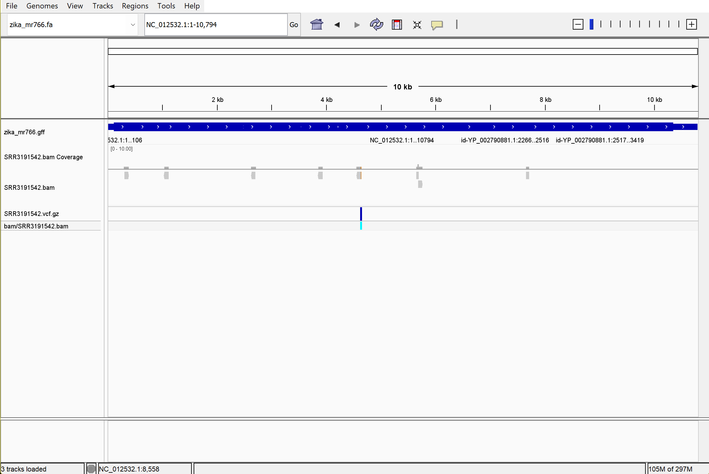

*Hello* **Dr. Albert**
# Assignment for week 10

NOTe: You can download Dr. Albert's Toolbox that contains Makefiles by running following code after activating micromamba. Working with 'bio' as follows:
```bash
bio code

# Make the bam files
make bam
# The output is in 'bam' file
# The reference genome is in the 'refs' file
# The reads are in the 'read' file

# The following code shows what the command that it will run
make vcf -n
make vcf
```
### Extend your existing Makefile to call variants on a single sample of your choice. 
Now let's get back to the assignment, the aim of this week is to extend the previous week's pipeline by adding a section for variant calling. Note that multiple BAM files will be generated for analysis based on the Zika Virus Study. We need 3 different files for this week: Makefile, README, and design.

#### Use your existing BAM file as input
#### Generate a VCF file for this sample
#### Follow best practices for variant calling

Creating the design file so it connects the SRR numbers to the sample names
```bash
# Get metadata based on the BioProject number
bio search PRJNA313294 -H --csv > design.csv
```

Download the reference Data and Its annotations
```bash
make refs
```

The chunk code below, combine the following aims with the code:
a) Download the interested reads based on the .cvs file
b) Align each of the reads to the reference genome (make the bam files)
c) Make the bigwig files to have the info for the coverage
d) Store the stat of the alignement and reading information
e) Generate vcf file for each of the bam files
```bash
cat design.csv | parallel --colsep , --header : --eta -j 4 'make readsvcf SRR={run_accession}'
```
The output is correct. Just there will be a minor error in bigwig files which is due to some SRRs have zero reads, because we set the N to 10k. But for viasualization I ran the Makefile without setting up the N, so it could show a good coverage of the files
#### Visualize the resulting VCF file data alongside the BAM file


#### In you markdown show how your Makefile should be used to call variants on a single sample.
### Call variants for all samples
#### Run the variant calling workflow for all samples using your design.csv file.
I tried it first with all of the SRRs in the design files.
### Create a multisample VCF
#### Merge all individual sample VCF files into a single multisample VCF file (bcftools merge)

The following command will merge all of the vcf.gz files into a single file as merged.vcf.gz so we can visualize all of the vcf files alogn each other:
```bash
bcftools merge vcf/*.vcf.gz -Oz -o vcf/merged.vcf.gz
```
#### Visualize the multisample VCF in the context of the GFF annotation file.


#### If any samples show poor alignment or no variants, identify and replace them with better samples. Ensure you have sufficient genome coverage across all samples
Now, let's remove all the downloaded and generated files
```bash
make clean
rm -rf vcf/merged.vcf.gz
```