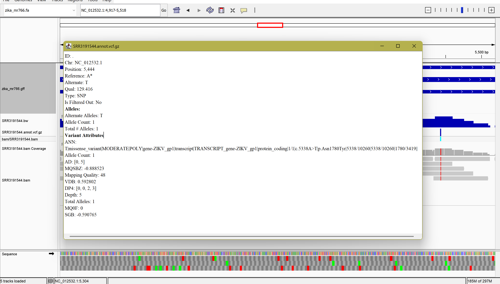

*Hello* **Dr. Albert**
# Assignment for week 10

### Overview
This Makefile downloads a reference genome + annotation, downloads example reads, runs QC, aligns reads to produce a BAM, generates coverage (wiggle/bigWig), calls variants (VCF), and provides a small snpEff workflow to build a local annotation DB and annotate the VCF.

### Important variables
ACC, GEN — accession / NCBI genome identifiers used by the ref target.
NAME — friendly name (used to name the local fasta, default zika_mr766).
SRR — read accession used to form R1, R2.
REF = ref/${NAME}.fa — reference FASTA path used throughout.
BAM = bam/${SRR}.bam — BAM path produced by align.
BG = bam/${SRR}.bedgraph and BW = bam/${SRR}.bw — coverage outputs from wiggle.
VCF = vcf/$(notdir $(basename ${BAM})).vcf.gz — constructed VCF path (e.g. vcf/SRR3191545.vcf.gz).
SNEFF_DB, SNEFF_DIR, SNEFF_GFF, SNEFF_FASTA, SNEFF_JAR — snpEff integration variables added for local DB build & annotation.

The number of the reads (N) to be downloaded set to 100k in order to make the code fast. 

### Files / directories produced
ref/: ref/${NAME}.fa, .gff, .gtf
reads/: ${SRR}_1.fastq, ${SRR}_2.fastq
bam/: ${SRR}.bam, ${SRR}.bam.bai, ${SRR}.bedgraph, ${SRR}.bw
vcf/: ${sample}.vcf.gz, ${sample}.vcf.gz.tbi, ${sample}.annot.vcf.gz (after annotation)
stats/: *_bam_flagstat.txt, *_bam_coverage.txt
snpEff/data/${SNEFF_DB}/ : sequences.fa, genes.gff, built database files

### commands 
Full run:
```bash
make all
```

Show the Makefile usage text:
```bash
make usage
```

Dry-run a target (see what would run):
```bash
make -n vcf
```
### Visualizing


### Analyzing three variants
##### 1

This is a SNP that changed the reference A to the alternative T at the position 1,399 of the chromosome NC_012532.1, which is our Zika reference. This variant happened in the protein coding region of the POLY gene. At the cDNA level it changed the T to c (c.1293A>T). At the protein level this variant causes no change, and the amino acid Leucine still coded (p.Leu431Leu|). Therefore, this Vairant is *synonomous variant*. The impact of the viariant is LOW, probably because it is a syn variant. The quality of the variant is very low (5.9710), and the AI said if the depth is decent, if it os less than 20-30, it considers sketchy. The depth is 3 (it is affected because of the limited number of read sequences from the SRR file), which means only 3 reads covered it, and from that 1 read support the reference allele A and two reads support the alternative allele T (AD:1,2). Additionally two alternative alleles read from the reverese strand (DP4:1,0,2,0). The mapping quality is 56 which looks fine. So, overall this variant has a low effect on that coding region of the POLY protein.

##### 2

This is a SNP changing the reference G to A at NC_012532.1:2,993 in the Zika reference. It falls in the coding region of the POLY polyprotein. At the cDNA level it’s c.2887G>A, and at the protein level it’s a *missense* change p.Glu963Lys (E→K). So, the variant also changed the AA. the snpEff flags this as MODERATE impact because the amino acid changes. Depth is 1, QUAL = 5.757, AD (0,1), and DP4 (0,0,0,1) meaning the support is a single ALT read on one reverse strand. Mapping quality is fine (60), but with one read that’s trivia, not validation.

##### 3

This is a SNP changing A→T at NC_012532.1:5,444 in the polyprotein (POLY). On the transcript it’s c.5338A>T, producing a *missense* change p.Asn1780Tyr (N→Y); snpEff calls that MODERATE impact, which fits a nonsynonymous substitution. Evidence is better compared to the two previous variants, QUAL 129.4 and Depth 5 with AD (0,5) and DP4 (0,0,2,3), meaning all five covering reads support the alternative across 2 forward and 3 reverse strands. Mapping quality 48 which is acceptable.