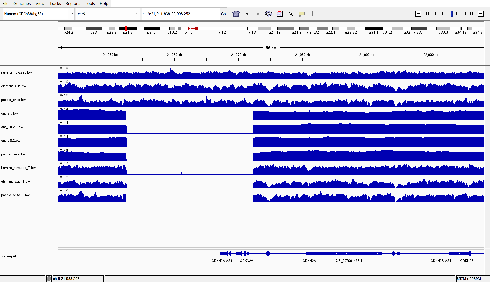
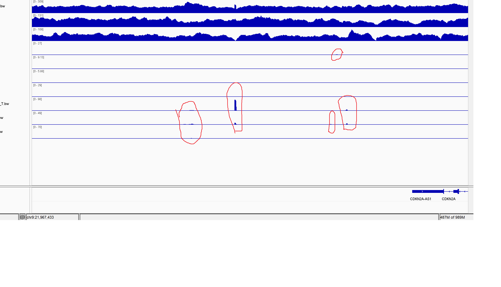

*Hello* **Dr. Albert**
# Assignment for week 12 - GIAB

### Overview
The aim of this week assignment is to downlaod the reference genome for a specific region of the genome and evaluate the alignment quality of the reads generated by different sequencing technologies/machines (Option 1).

The Genome In A Botttle (GIAB) is a project to create benchmarked human reference genomes so different labs can validate, compare, and standardize theor sequenicing and variant-calling pipelines against a trusted source. Cancer GIAB has the same goal but with tumor-normal pairs. For whole Genome sequencing, the project used technologies that situated in 4 different approaches: short-read, long-read, single cell, and chromatin configuration capture. In this assignment we want tu compare the technologies for short-reead (Illumina Novaseq, Element Aviti, Pacbio Onso, Ultima standard, Ultima ppmSeq) and long-read sequencing (ONT-standard, ONT-UL E8.2, ONT-UL E8.2.1, PacBop Revio, Pacbio Vega).

So, the approach we took for this evaluation is first to make a design.csv file that contains the web address for downloading the reference from each sequencing technology. So, in the design file you will fin the name of the technologies in the first column and the RUL for the BED files of each of the technologies. Then using parallel for the design file to go over our Makefile, which contains the code for downloading the BAM files from the project for comparison. At the end we can extract the quality information of each read to our reference genome to evaluate which technology produce better reads.

The region of our interest is containing the *CDKN2A* gene which located on chromose 9 short arm 9p21.3 (chr9:21,967,752-21,995,324 for latest assembly in GRCh38/hg38). This gene contains 27,573 bases and encodes the Cyclin Dependent Kinase Inhibitor 2A. this gene produce three transcript variants that differ in their first exons. Two of its splice variants either inhibit CDK4 to block the cell cycle G1 progeression or the other splice variant produce an alternate open reading frame which stabilizes p53 (a famous tumor supressor protein) by restraining MDM2, which is responsible for degradation of p53. The deleted or mutated forms of this gene found in many tumors, especially in pancreatic cancers (Melanoma-Pancreatic Cancer Syndrome) 

some notes:
a) Some technologies just used in normal tissues while some just in tumor tissue.
b) both of the ultima machines (standard and ppmseq) are not included in the analysis because generate generat cram file instead of bam file.
c) short reads compare the sequences of normal duodenal (N-D) tissues, while long reads compare the tumor (T) samples.
d)pacbio vega for the long read sequences is not included in the analysis, because I could not find which of the pacbio bam files is for the Vega machine, there was not such info in the readme files of the two pacbio reads.

Now, let's run the makefile:
```bash
# downoading the referencce
make ref
# Parallel running for downloading bam files, generating bigwig files, and acquiring stats for each sequences of the machine
cat design.csv | parallel --colsep , --header : --eta --lb -j 4 make bam TECH={tech} BAM_URL={address}
```
characterstics we covered:
1. reads mapped / sequences and reads unmapped: Overall mappability. Higher is better. Compare as a percentage.

2. error rate (mismatches / bases mapped [cigar]): Lower is better.

3. average quality: Sanity check that Phred scores align with error rate.

4. reads MQ0 (count and fraction of mapped reads): Lower is better. High MQ0 shows ambiguous mappings.

5. supplementary alignments: Too many can indicate chimeras/adapter mess or ultra-fragmented mapping.

6. reads duplicated / bases duplicated: Library/optical duplicates; lower is better. If 0, dedup may not have been run.

7. average length: Confirms read length specs match the platform.

| tech | Tot Seq | Mapped | Map/seq(%) | err rate | avg qual | MQ0 | supp align | rd/bs dup | avg lng | max lng |
|-----:|-------:|--------:|-----------:|---------:|---------:|----:|-----------:|----------:|--------:|--------:|
| illumina_novaseq | 1169975 | 1168397 | 99.8 | 3.498389e-03 | 35.8 | 4382 | 1027 | 0 | 151 | 151 |
| element_aviti | 615368 | 614850 | 99.9 | 2.767952e-03 | 49.0 | 2866 | 680 | 0 | 148 | 150 |
| pacbio_onso | 364290 | 358601 | 98.4 | 2.040964e-03 | 50.2 | 1774 | 2117 | 0  | 144 | 150 |
| ont_std | 1503 | 1503 | 1 | 4.388355e-02 | 34.6 | 0 | 78 | 0 | 23266 | 114327 |
| ont_ul8.2 | 603 | 603 | 1 | 5.486216e-02 | 33.1 | 0 | 21 | 0 | 59652 | 461209 |
| ont_ul8.2.1 | 863 | 863 | 1 | 3.277349e-02 | 40.8 | 0 | 18 | 0 | 39942 | 306393 |
| pacbio_revio | 3142 | 3142 | 1 | 5.243023e-03 | 38.1 | 0 | 42 | 0 | 18107 | 42875 |

Among short reads, all three perform strongly, but Aviti performs a little ahead on base accuracy with comparable mapping to NovaSeq, while Onso shows little lower mapping yet the best mismatch profile of these three; in practice, NovaSeq and Aviti are both excellent for variant calling. Among long reads, PacBio Revio delivers the best balance of accuracy and consistency, whereas ONT datasets prioritize extreme length with noticeably higher error rates despite clean mapping behavior; they’re ideal for spanning repeats and structural variants, not fine-grained SNP work. Comparing between these two methods, short reads are superior for base-level accuracy and clean SNP/indel calling, while long reads win for structural variation and assembly. Additionally, we have to keep in mind that these statistics is specifically for that region of our interest. Maybe for other parts these stats would be different, for example the structure such as the number of repeats would affect the reading quality and they would have a better performance for other regions of the genome.



Updates: Three bam files of short read machines for the tumor samples (T) added to the design.csv file to look over the missing chunk of the dna in the T samples in more details, and ran the code again. The figure also updated with having the bw files of the added samples into the IGV. 
although long read machines completely miss that part, short read sequencing machines have some low coverage for some part of the chunck as shown below.



 At first I thought this part is deleted in the T samples, but since short read machines could read some part of it, the reason that this part is missing might be because this part of the genome of T samples is hard to read by the machines, especially long read machines. Am I on the right track or missing something? Or the reads from short read machines could be resulted from mismatch? what could be other factors that might play a role?