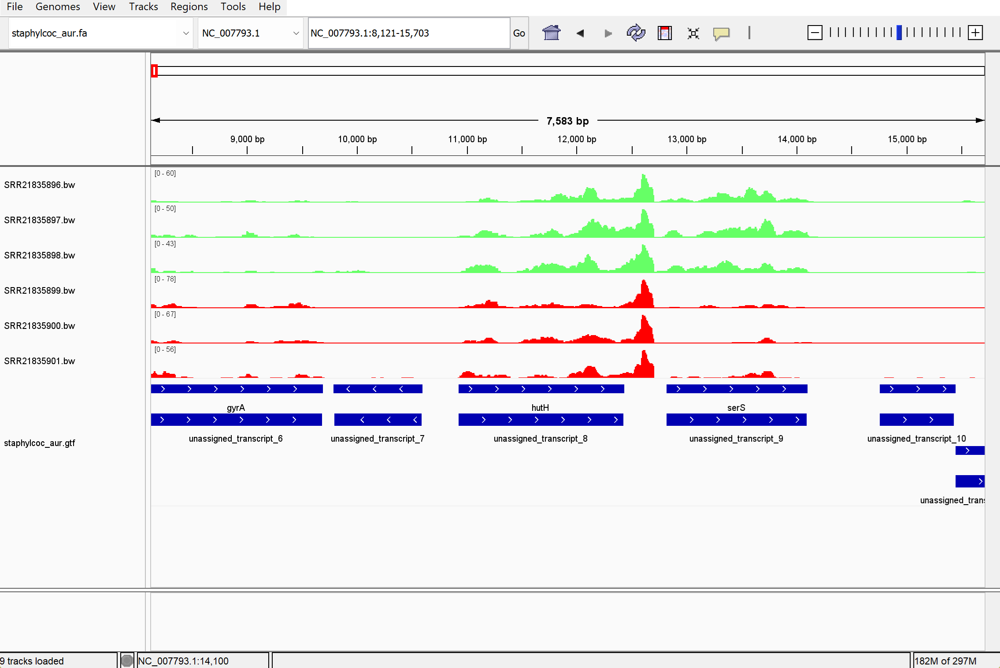
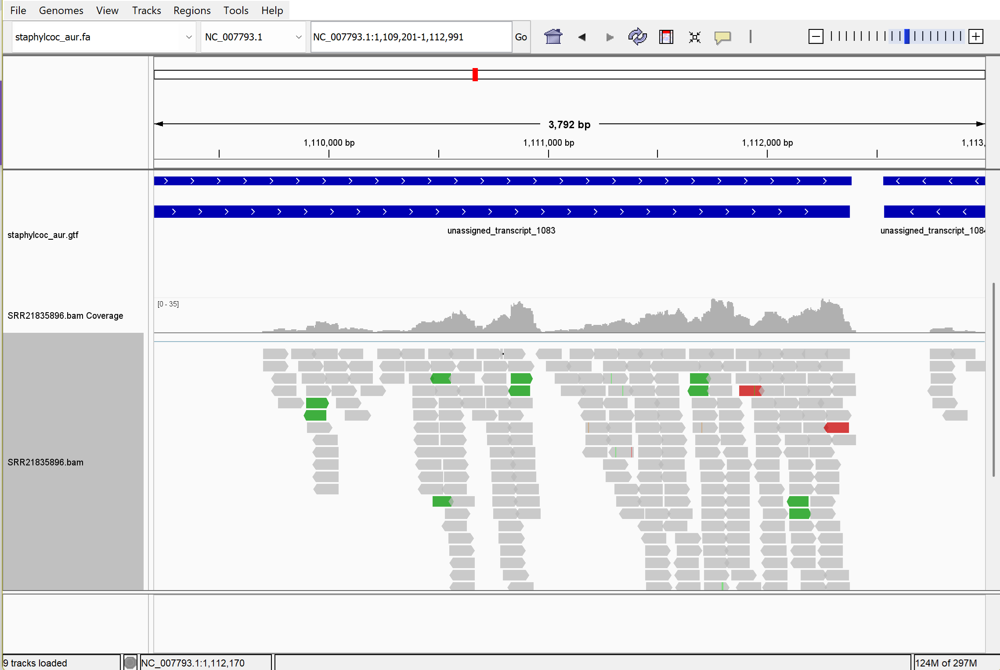

*Hello* **Dr. Albert**
# Assignment for week 13 - Generate a Genome-based RNA-seq count matrix
### Overview
The goal of this assignment is to generate a count matrix from RNA-seq data using a reference genome. We will use Staphylococcus aureus as the model organism. the reads have three samples as control and 3 samples as treatment. We wanted to compare the gene expression levels between these two groups. The project number for the RNA-seq data is PRJNA887926. 

### Get the data
We can also use  the following command to generate to get the metadata and design.csv file (but I skipped it and created the csv file manually):
```bash
bio search PRJNA887926 -H --csv > design.csv
```
The makefile contains the rules to download the reference genome, index it, download the reads.

```bash
micromamba activate bioinfo
make ref
make index
cat design.csv | parallel --colsep , --header : --eta -j 4 'make read SRR={srr_id}'
```
### Align the reads to the reference genome
From the same Make file the following code will be used to align the reads to the reference genome and generate the bam files with related coverage files. We used Hisat2 for that purpose.
```bash
cat design.csv | parallel --colsep , --header : --eta -j 4 'make run SRR={srr_id}'
```
### Visualize the alignments in IGV
Below picture is the vualization of all the 6 samples in IGV:


it looks like the annotation files is not so much accurate because the following figure shown that there are some misalignment issue and the reads show coverage outside of the annotated regions:


based on the following figure, it not clear if the data is stranded or unstranded. So we will run featureCounts again with unstranded option (-s 0). However, in case we have to consider that the read was antisense stranded, we will also run featureCounts with -s 2 option.

### Generate the count matrix
No we are going to generate the count matrix using featureCounts. Note that originally the reads are paired-end, but we just use one read to create the bam files. Use the paired-end flag (-p) and set threads (-T) when running featureCounts to avoid the "Paired-end reads were detected in single-end read library" error:
```bash
featureCounts -p -T 4 -a ref/staphylcoc_aur.gtf -o counts.txt bam/*.bam
```
Now we have to reformat the count matrix. First we change the bioinfo environment and activate the stats environment. 
```bash
bio code
micromamba activate stats
```
Then we run the following R script to convert the count matrix from txt to csv format.
```bash
Rscript src/r/format_featurecounts.r -c counts.txt -o counts.csv
```
We use the following R script to create a tx2gene mapping file but the name of our organism, stophylococus aureus was not here. So we could not use the name of the genes in the csv files. 
```bash
Rscript src/r/create_tx2gene.r -s > names.txt
```
### Differential expression checking
Base on checking by eyes in csv file, SAUSA300_RS02680, SAUSA300_RS02685, SAUSA300_RS11100 looks like significantly differentially expressed genes between control and treatment groups.