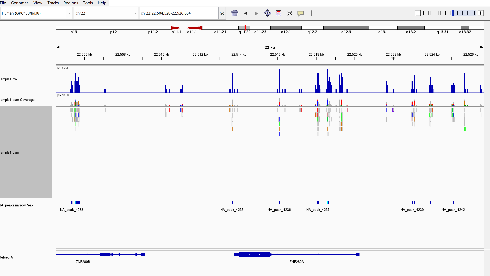

*Hello* **Dr. Albert**
# Assignment for week 15 - Epigenomic mapping regulates cell identity in bladder cancer
### Info on the paper used for reproducing the data
Link to the paper: Epigenomic mapping identifies an enhancer repertoire that regulates cell identity in bladder cancer through distinct transcription factor networks Oncogene. 2023 Mar 22;42(19):1524–1542
SRA BioProject ID: PRJNA798359
subset of data: SRR17653520

We aim to reproduce the findings from the paper. First, in order to focus and develope the analysis, we will work on one million reads (N=1M) from a single sample (SRR17653520). And we just align the reads to chromosome 22 (https://hgdownload.soe.ucsc.edu/goldenPath/hg38/chromosomes/chr22.fa.gz)

Prepare the environment and necessary files
```bash
micromamba activate bioinfo
touch README.md
touch Makefile
touch design.csv
```
Running the following line of code will create a folder *src* that contains different folders with already prepared makefiles for different purposes, especially the prepared Makefiles in *src/run*. each of the Makefiles can be modified to fit it to the need of the analysis.
```bash
bio code
```
Now, let's start using the pre prepared Makefiles. The first step is to download the reference data (FASTA) which is for now is only chromosome 22. We are going to use the *curl.mk* makefile.
```bash
URL=https://hgdownload.soe.ucsc.edu/goldenPath/hg38/chromosomes/chr22.fa.gz
make -f src/run/curl.mk URL=${URL} run
```
The downloaded reference is a gzip file, but for the downstream analysis, the samtools needs a bgzip file. Therefore, we have to recompress the gzip file to bgzip file by the *bgzip.mk* makefile.
```bash
REF=refs/chr22.fa.gz
make -f src/run/bgzip.mk FILE=${REF} run
```
Now, we have to index the reference genome by *bwa* to align the reads (which will be downloaded in the next step) to the reference genome, chromosome 22 here.
```bash
make -f src/run/bwa.mk REF=${REF} index
```
Now let's move on by downloading the reads. We are going to download just 1M reads. The study used single-end reads, that's why we will have one reaad file per sample.
```bash
N=1000000
# the path to read 1
R1=reads/sample1_pair1.fastq

# download 1M reads from SRR17653520
make -f src/run/sra.mk \
    SRR=SRR17653520 \
    N=${N} \
    R1=${R1} \
    run
```
Next step is to align the reads and make the BAM file.
```bash
# path to BAM file
BAM=bam/sample1.bam

# align the reads to the reference genome
make -f src/run/bwa.mk REF=${REF} R1=${R1} BAM=${BAM} align
```
Since, the BAM files do not show on IGV at the default zoom level, we will create coverage tracks which is BigWig files. The enables us to visualize alignemnts coverage across the genome.
```bash
make -f src/run/coverage.mk BAM=${BAM} REF=${REF} run
```

Now we have to do the peak calling to identify the regions in the genome that are enriched with aligned reads. We gonna use MACS2 (Model-based Analysis for ChIP-Seq) for that (https://macs3-project.github.io/MACS/). Adding to that for ChIP-seq analysis we need control data also, but in this case we didn't have control sample (https://hbctraining.github.io/Intro-to-ChIPseq/lessons/05_peak_calling_macs.html).
```bash
# create the environment for macs2
micromamba create -n peak -y macs2

micromamba activate peak
micromamba remove macs2
micromamba install -c conda-forge -c bioconda macs3

# run the macs3 tool in the peak environment
micromamba run -n peak macs3 callpeak -t ${BAM} --outdir peak
```



by the following code I can rerun the whole process for another dataset:
```bash
make SRR=SRR17653521 SAMPLE=sample2 all
```
The makefile contain the code for the steps:
- download, recompress, and index the reference genome
- download the reads
- align the reads to the reference genome and create coverage tracks
- call peaks using MACS3
